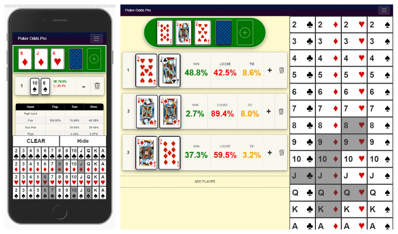

# Poker Odds Pro – A Blazor (No JavaScript) Progressive Web App

The project is an experiment to set up a blazor WebAssembly app and server app with all components and code being shared and written in pure C#. 

The project is already configured to run as a single page app on GitHub pages. 

You can find an example of the hosted app here: [PokerOddPro Live Demo](https://dyh1213.github.io/PokerOddsPro.io/)

You can see a video of the app here: PokerOddPro [Youtube Video](https://www.youtube.com/watch?v=YEwy2yhG9P4)

The web app is responsive and displays on both mobile and desktop.

## Getting Started

These instructions will get you a copy of the project up and running on your local machine for development and testing purposes. See deployment for notes on how to deploy the project on a live system.

### Prerequisites
Don't know what Blazor is? Read [here](https://docs.microsoft.com/en-us/aspnet/core/blazor)

Complete all Blazor dependencies.

- The latest [.Net Core SDK](https://dotnet.microsoft.com/download/dotnet-core/3.1)
- Install the Latest Visual Studio 2019 with the ASP.NET and web development workload selected.

### How to run
1. Install the latest [.NET Core SDK] (https://dotnet.microsoft.com/download/dotnet-core/3.1) and the latest version of visual studio 2019.
2. Clone or download.
3. Open the solution in Visual Studio and press F5.

End with an example of getting some data out of the system or using it for a little demo

## Solution Structure

The solution has 4 projects

### PokerOddsPro.ServerApp

Use this project to start-up the app in server mode. This makes it much easier to debug, and makes the app run much faster.

### PokerOddsPro.WebAssembly

Use this project to start-up the project in client-side mode. This makes it much harder to debug, but the app does not require any server! It also has the service-worker.js file allowing it to run as a PWA from supported devices.

### PokerOddsPro.Shared

This project has all the razor and C# code requires to run the application. The code is shared between the server and client project, 
PokerOddsEngine

### PokerOddsPro.OddsEngine

This is a project containing the “backend” logic for computing Texas holdem poker odds. It uses pre-computed tables and is a fairly fast poker odds calculator.

## Deployment

### How to upload the app as a PWA to GitHub Pages

1.	In the PokerOddsPro.WebAssembly/wwwroot/index.html ensure the href property is set to the name of you GitHub page instead of root. Example: If you page is named “mypage.io” then replace <base href="/" /> with <base href="/blazorAppTest.io/" />
2.	Rebuild the PokerOddsPro.WebAssembly solution
3.	Right click the solution and click publish then publish again.
4.	Go to: [YOUR PATH]\PokerOddsCalculatorPWA\PokerOddsCalculatorPWA.WebAssembly\bin\Release\netstandard2.1\publish\wwwroot
5.	Upload content to a GitHub Page!

note: I adde the ".nojekyll" file to the webassembly solution and relevant javascript for the app to host on github in the "index.html" file. See the comment "Start Single Page Apps for GitHub Pages".

## Built With

* [Blazor WevAssembly 3.2.0 (.NET Core 3.1) with the PWA Template](https://dotnet.microsoft.com/download/dotnet-core/3.1)
* [Visual studio 2019](https://visualstudio.microsoft.com/downloads/)
* BlazorPro.BlazorSize - Nuget package for detecting screen size
## Contributing

Please star, watch and fork! We'd greatly appreciate any contribution you make. 

## Authors

* **Daniel Hai**

## Room for improvements

Doing the odds calculation right now in the client is computationally heavy. For that reason right now you need to put at least two cards on the board to calculate the odds. However, once blazor becomes faster this can be removed. 

## License

This project is licensed under the MIT License - see the [LICENSE.md](LICENSE.md) file for details

## Acknowledgments

* Inspiration + some iamges for the playing cards taken from [yyjhao](https://github.com/yyjhao/html5-hearts)  
* Inspiration + static files for poker odds engine taken from: [Keith Rule](https://www.codeproject.com/Articles/12279/Fast-Texas-Holdem-Hand-Evaluation-and-Analysis)  

